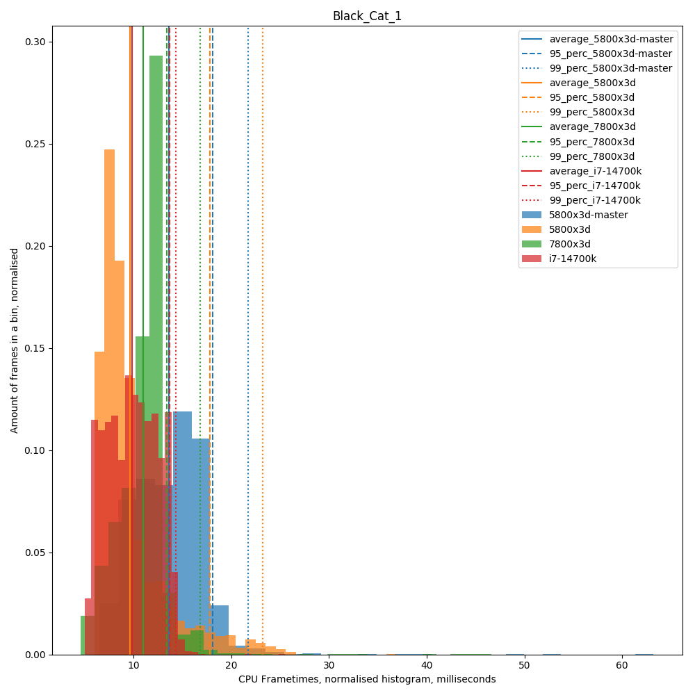
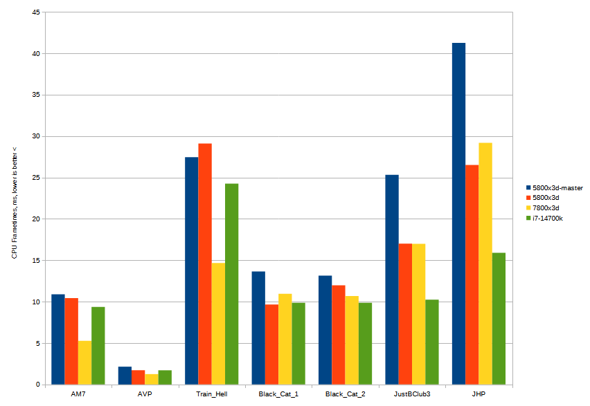

# Comparison of newest generation Intels vs x3d

4 people, going to the same worlds, standing in the same spot, looking at the same direction, recording CPU frametimes using FPSVR

+ 1st 5800x3d, RTX 3080, Vive Pro 2 - joined worlds first - master, VRChat OpenBeta
+ 2nd 5800x3d, 64 GB RAM @ 3066 MHz, RTX 3090 24 GB, Index, VRChat Stable
+ 3rd 7800x3d, 32 GB RAM @ 5600 MHz, RTX 3090 24 GB, Quest Pro over Steamlink, Suspected throttling
+ 4th i7-14700k, 32 GB RAM @ 6000 MHz, RTX 4080, Index

All matched the same VRChat settings and 2k x 2k resolution per eye

VRChat build 1456

Benchmark date 2024-05-30 (hot...)

## AVP world

https://vrchat.com/home/world/wrld_141db797-567c-4dc0-bbdc-df50ec61b7c2

private instance

5800x3d-master average CPU frametimes: 2.15+-0.25 ms, 95 percentile: 2.40 ms, 99 percentile: 2.70 ms

5800x3d-master average CPU FPS: 465.70+-34.58 FPS, 95 percentile: 416.67 FPS, 99 percentile: 370.37 FPS

5800x3d average CPU frametimes: 1.72+-0.24 ms, 95 percentile: 1.90 ms, 99 percentile: 2.10 ms

5800x3d average CPU FPS: 581.75+-49.38 FPS, 95 percentile: 526.32 FPS, 99 percentile: 476.19 FPS

7800x3d average CPU frametimes: 1.25+-0.06 ms, 95 percentile: 1.40 ms, 99 percentile: 1.40 ms

7800x3d average CPU FPS: 798.81+-39.45 FPS, 95 percentile: 714.29 FPS, 99 percentile: 714.29 FPS

i7-14700k average CPU frametimes: 1.71+-0.12 ms, 95 percentile: 1.90 ms, 99 percentile: 1.90 ms

i7-14700k average CPU FPS: 584.07+-30.12 FPS, 95 percentile: 526.32 FPS, 99 percentile: 526.32 FPS

## Avatar Museum 7

https://vrchat.com/home/world/wrld_9e4737d6-76df-4e01-a065-f997ec031cd5

private instance

5800x3d-master average CPU frametimes: 10.89+-2.75 ms, 95 percentile: 16.20 ms, 99 percentile: 20.10 ms

5800x3d-master average CPU FPS: 91.86+-20.48 FPS, 95 percentile: 61.73 FPS, 99 percentile: 49.75 FPS

5800x3d average CPU frametimes: 10.43+-2.47 ms, 95 percentile: 14.30 ms, 99 percentile: 14.90 ms

5800x3d average CPU FPS: 95.90+-25.59 FPS, 95 percentile: 69.93 FPS, 99 percentile: 67.11 FPS

7800x3d average CPU frametimes: 5.28+-0.33 ms, 95 percentile: 5.70 ms, 99 percentile: 6.10 ms

7800x3d average CPU FPS: 189.40+-7.98 FPS, 95 percentile: 175.44 FPS, 99 percentile: 163.93 FPS

i7-14700k average CPU frametimes: 9.36+-1.79 ms, 95 percentile: 12.00 ms, 99 percentile: 12.20 ms

i7-14700k average CPU FPS: 106.84+-22.33 FPS, 95 percentile: 83.33 FPS, 99 percentile: 81.97 FPS

## Train Hell

https://vrchat.com/home/world/wrld_8313f004-7ddc-4bd6-9f56-4ba52f8618e4

private instance

5800x3d-master average CPU frametimes: 27.45+-2.40 ms, 95 percentile: 30.91 ms, 99 percentile: 37.80 ms

5800x3d-master average CPU FPS: 36.43+-2.71 FPS, 95 percentile: 32.35 FPS, 99 percentile: 26.46 FPS

5800x3d average CPU frametimes: 29.11+-7.72 ms, 95 percentile: 44.70 ms, 99 percentile: 48.80 ms

5800x3d average CPU FPS: 34.35+-8.53 FPS, 95 percentile: 22.37 FPS, 99 percentile: 20.49 FPS

7800x3d average CPU frametimes: 14.66+-2.75 ms, 95 percentile: 17.90 ms, 99 percentile: 28.68 ms

7800x3d average CPU FPS: 68.20+-9.57 FPS, 95 percentile: 55.87 FPS, 99 percentile: 34.87 FPS

i7-14700k average CPU frametimes: 24.26+-5.29 ms, 95 percentile: 33.40 ms, 99 percentile: 35.47 ms

i7-14700k average CPU FPS: 41.23+-8.87 FPS, 95 percentile: 29.94 FPS, 99 percentile: 28.19 FPS

## Just B Club 3

https://vrchat.com/home/world/wrld_e6569266-21cd-4275-8aef-47fcb7458931

public instance, full of people

5800x3d-master average CPU frametimes: 25.32+-6.38 ms, 95 percentile: 34.00 ms, 99 percentile: 46.05 ms

5800x3d-master average CPU FPS: 39.49+-367.23 FPS, 95 percentile: 29.41 FPS, 99 percentile: 21.72 FPS

5800x3d average CPU frametimes: 17.01+-4.97 ms, 95 percentile: 24.40 ms, 99 percentile: 26.00 ms

5800x3d average CPU FPS: 58.80+-21.44 FPS, 95 percentile: 40.98 FPS, 99 percentile: 38.47 FPS

7800x3d average CPU frametimes: 16.99+-3.95 ms, 95 percentile: 20.80 ms, 99 percentile: 23.46 ms

7800x3d average CPU FPS: 58.86+-16.48 FPS, 95 percentile: 48.08 FPS, 99 percentile: 42.62 FPS

i7-14700k average CPU frametimes: 10.24+-2.59 ms, 95 percentile: 14.20 ms, 99 percentile: 14.80 ms

i7-14700k average CPU FPS: 97.62+-27.01 FPS, 95 percentile: 70.42 FPS, 99 percentile: 67.57 FPS

## Black Cat 1

We realized some poeple have nameplates on.

https://vrchat.com/home/world/wrld_4cf554b4-430c-4f8f-b53e-1f294eed230b

5800x3d-master average CPU frametimes: 13.64+-3.52 ms, 95 percentile: 18.11 ms, 99 percentile: 21.70 ms

5800x3d-master average CPU FPS: 73.34+-20.74 FPS, 95 percentile: 55.22 FPS, 99 percentile: 46.08 FPS

5800x3d average CPU frametimes: 9.65+-3.55 ms, 95 percentile: 17.81 ms, 99 percentile: 23.20 ms

5800x3d average CPU FPS: 103.64+-28.10 FPS, 95 percentile: 56.15 FPS, 99 percentile: 43.10 FPS

7800x3d average CPU frametimes: 10.96+-2.50 ms, 95 percentile: 13.40 ms, 99 percentile: 16.80 ms

7800x3d average CPU FPS: 91.26+-25.58 FPS, 95 percentile: 74.63 FPS, 99 percentile: 59.52 FPS

i7-14700k average CPU frametimes: 9.86+-2.51 ms, 95 percentile: 13.70 ms, 99 percentile: 14.30 ms

i7-14700k average CPU FPS: 101.45+-30.11 FPS, 95 percentile: 72.99 FPS, 99 percentile: 69.91 FPS

## Black Cat 2

Second try, without nameplates on. All nameplates off

https://vrchat.com/home/world/wrld_4cf554b4-430c-4f8f-b53e-1f294eed230b

5800x3d-master average CPU frametimes: 13.14+-3.20 ms, 95 percentile: 17.40 ms, 99 percentile: 20.50 ms

5800x3d-master average CPU FPS: 76.11+-21.52 FPS, 95 percentile: 57.47 FPS, 99 percentile: 48.78 FPS

5800x3d average CPU frametimes: 11.98+-4.82 ms, 95 percentile: 22.20 ms, 99 percentile: 24.40 ms

5800x3d average CPU FPS: 83.49+-31.27 FPS, 95 percentile: 45.05 FPS, 99 percentile: 40.98 FPS

7800x3d average CPU frametimes: 10.68+-2.26 ms, 95 percentile: 13.00 ms, 99 percentile: 14.90 ms

7800x3d average CPU FPS: 93.63+-27.12 FPS, 95 percentile: 76.92 FPS, 99 percentile: 67.11 FPS

i7-14700k average CPU frametimes: 9.87+-2.48 ms, 95 percentile: 13.60 ms, 99 percentile: 14.30 ms

i7-14700k average CPU FPS: 101.32+-30.04 FPS, 95 percentile: 73.53 FPS, 99 percentile: 69.93 FPS

## Summary

