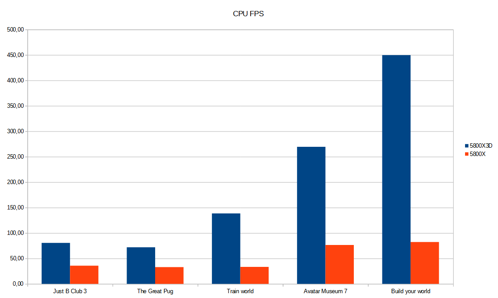
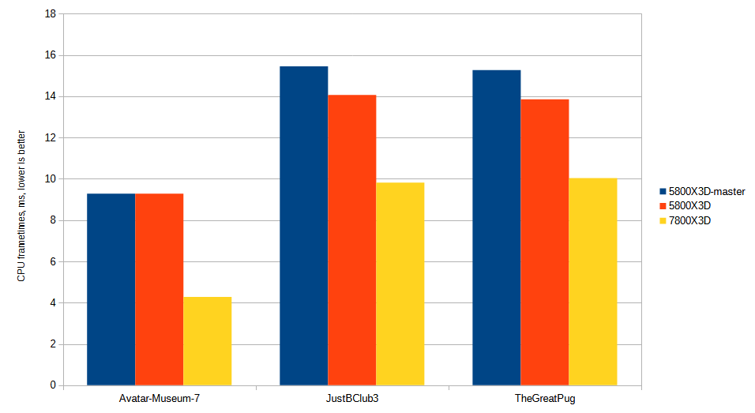
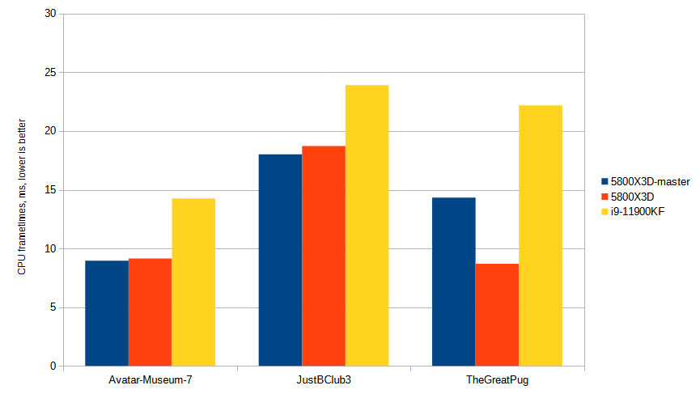
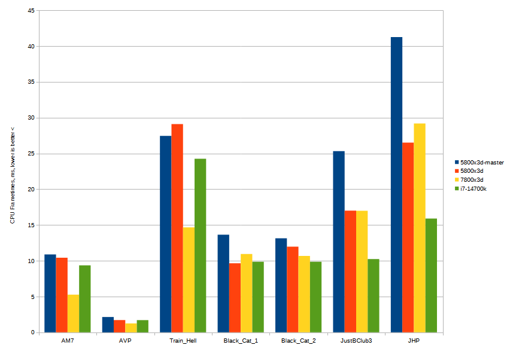

# Introduction

This repository details multiple benchmarking attempts to compare two different CPUs and their relative performance.
Two users join the same instance and compare CPU performance while standing in the same area.
Except for the public worlds testing avatar performance, instances were private only with banchmarkers present in VR.

# Benchmark 1 

Purely X3D vs non X3D AMD CPU test

[Read here](https://github.com/Greendayle/VRChat-benchmark-cache/blob/main/first_benchmark/benchmark.md)

Summary:

# Benchmark 2

Cross generational AMD benchmark 5800x3d vs 7800x3d on new VRChat from 2024

[Read here](https://github.com/Greendayle/VRChat-benchmark-cache/blob/main/amd-generations-test/summary.md)

Summary:

# Benchmark 3

We finally get an Intel volunteer, albeit with an older one

[Read here](https://github.com/Greendayle/VRChat-benchmark-cache/blob/main/intel-11th-vs-x3d/intel11-summary.md)

Summary:

# Compiling Benchmark 2 and 3

From those 2 tests we can extract one datapoint which is directly comparable:

# Benchmark 4

Finally we found a volunteer with a newest 14th generation intel

[Read here](https://github.com/Greendayle/VRChat-benchmark-cache/blob/main/intel14th-gen/intel14-summary.md)

Summary:

We suspect that out 7800x3d volunteer had throttling issues due to hot weather. Based on previous benchmarks the 7800x3d should have been at least twice as fast. New Windows/VRChat updates might have degraded the performance too. More benchmarks are needed.

# Conclusions

Benchmarking VRChat CPU performance in VR in realistic setting of public worlds is not easy, and requires simultaneous effort from multiple people. As much as we try to have similar software settings, setups are quite different. But we hope that SteamVR reported CPU frametimings are more or less independent of GPU performance. We tried to minimise GPU performance impact, by reducing resolution to around 2000x2000 per eye, and disabling antialiasing. GPU frametimes are also available in archived files for further inspection.

Roughly it seems that in some objects and udon heavy worlds 7800x3d can beat the i7-14700k. In a small light world, too. But in the latest Benchmark 4, publics performance of 7800x3d has degraded, falling to 5800x3d levels. If we compare i7-14700k with results of a previous benchmark, i7-14700k is roughly equal in performance of 7800x3d (while consuming way less power).
