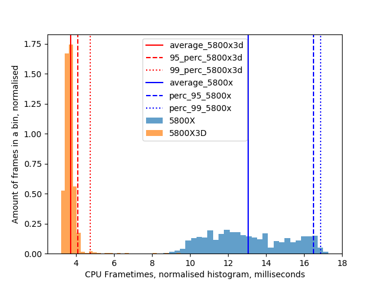
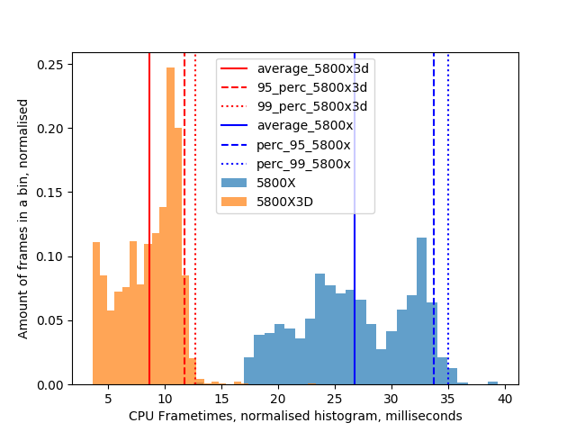
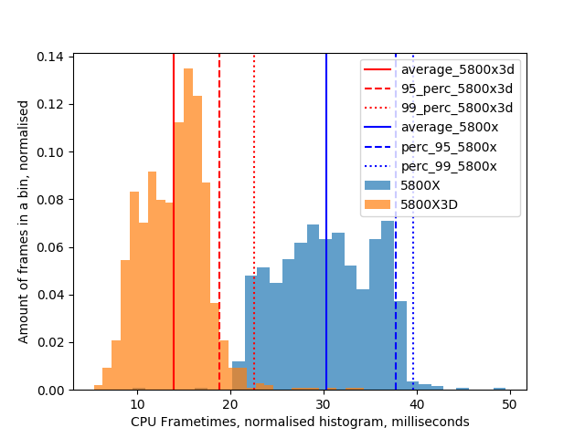

# Intro

Two person benchmark, joining the same world and instances. Standing in the same spot. Recording frame timings using FPSVR.

One person: Valve Index, Nvidia 3090, AMD Ryzen 5800X

Second person: Vive Pro 2, Nividia 3080, AMD Ryzen 5800X3D

Resolution matched to 2500 x 2500 pixels per eye. 

# Build your world

https://vrchat.com/home/world/wrld_7786c206-d0e2-49c2-856d-a3aa018b2b94

Build your world. Empty:

5800X3D average CPU frametimes: 3.68+-0.42 ms, 95 percentile: 4.40 ms, 99 percentile: 4.70 ms

5800X average CPU frametimes: 1.67+-0.20 ms, 95 percentile: 1.90 ms, 99 percentile: 2.10 ms

Build your world. Full, spawn:

5800X3D average CPU frametimes: 3.81+-0.48 ms, 95 percentile: 4.70 ms, 99 percentile: 5.10 ms

5800X average CPU frametimes: 12.15+-2.55 ms, 95 percentile: 16.50 ms, 99 percentile: 17.30 ms

Build your world. Full, standing on a collider:

5800X3D average CPU frametimes: 5.08+-0.92 ms, 95 percentile: 6.90 ms, 99 percentile: 7.20 ms

5800X average CPU frametimes: 12.27+-2.57 ms, 95 percentile: 16.50 ms, 99 percentile: 17.10 ms

# Avatar Museum 7

https://vrchat.com/home/world/wrld_9e4737d6-76df-4e01-a065-f997ec031cd5

Avatar museum, standing in the middle

5800X3D average CPU frametimes: 5.75+-1.69 ms, 95 percentile: 8.70 ms, 99 percentile: 9.06 ms

5800X average CPU frametimes: 13.07+-2.10 ms, 95 percentile: 16.50 ms, 99 percentile: 16.87 ms

Avatar museum, spawn

5800X3D average CPU frametimes: 3.05+-0.70 ms, 95 percentile: 4.30 ms, 99 percentile: 4.70 ms

5800X average CPU frametimes: 8.17+-3.66 ms, 95 percentile: 14.10 ms, 99 percentile: 15.34 ms

# Japanese Train simulator

https://vrchat.com/home/world/wrld_f466709e-f226-478f-a598-b8a4ba52aa70

Train world, watching the wagons

5800X3D average CPU frametimes: 9.09+-1.18 ms, 95 percentile: 11.00 ms, 99 percentile: 11.30 ms

5800X average CPU frametimes: 27.66+-4.85 ms, 95 percentile: 35.20 ms, 99 percentile: 37.00 ms

Train world, watching the city

5800X3D average CPU frametimes: 10.12+-1.02 ms, 95 percentile: 11.50 ms, 99 percentile: 11.90 ms

5800X average CPU frametimes: 26.76+-4.91 ms, 95 percentile: 33.70 ms, 99 percentile: 35.01 ms

Train world, riding the train

5800X3D average CPU frametimes: 15.64+-1.05 ms, 95 percentile: 17.30 ms, 99 percentile: 17.70 ms

5800X average CPU frametimes: 29.82+-5.11 ms, 95 percentile: 38.00 ms, 99 percentile: 39.70 ms

# The Great Pug

https://vrchat.com/home/world/wrld_6caf5200-70e1-46c2-b043-e3c4abe69e0f

The Great Pug, stage area, big group of people in view

5800X3D average CPU frametimes: 10.28+-1.26 ms, 95 percentile: 11.80 ms, 99 percentile: 12.10 ms

5800X average CPU frametimes: 30.25+-5.11 ms, 95 percentile: 37.77 ms, 99 percentile: 39.64 ms

# Just B Club 3

https://vrchat.com/home/world/wrld_b2d9f284-3a77-4a8a-a58e-f8427f87ba79

Just B Club 3, spawn, big group of avatars in view:

5800X3D average CPU frametimes: 16.88+-2.32 ms, 95 percentile: 18.38 ms, 99 percentile: 18.70 ms

5800X average CPU frametimes: 27.98+-5.89 ms, 95 percentile: 36.40 ms, 99 percentile: 37.60 ms

# Conclusion

5800X3D is around 3 times faster than 5800X, and has WAY smaller frametiming variance.

