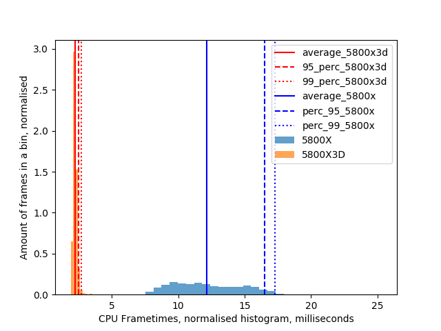
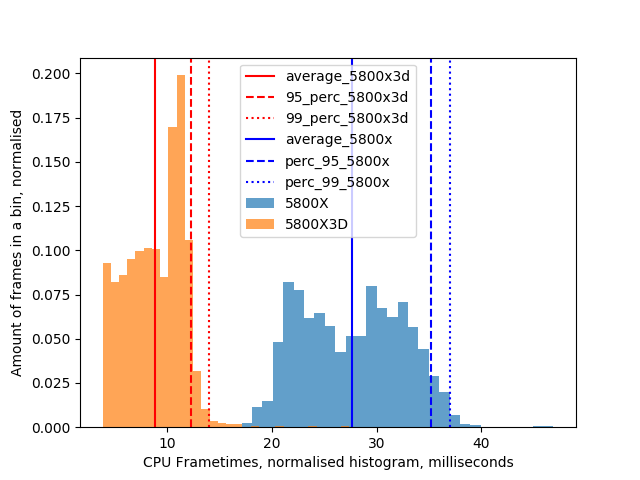
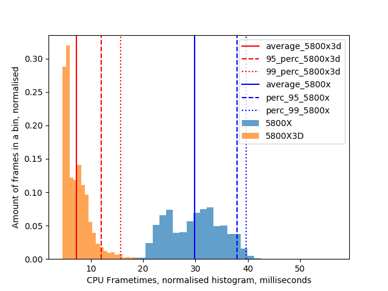
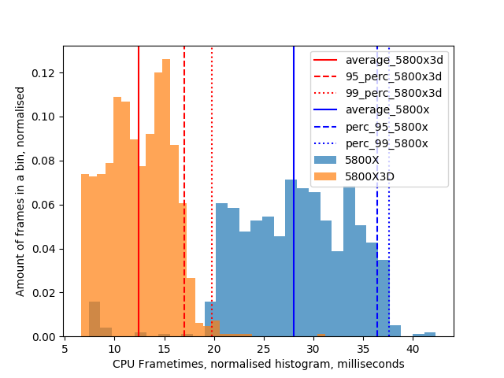

# Intro FIXED!

Two person benchmark, joining the same world and instances. Standing in the same spot. Recording frame timings using FPSVR.

One person: Valve Index, Nvidia 3090, AMD Ryzen 5800X

Second person: Vive Pro 2, Nividia 3080, AMD Ryzen 5800X3D

Resolution matched to 2500 x 2500 pixels per eye. 

State for 2023.02.18.

# Build your world

Light world, until you spawn many objects. All objects from the catalog were spawned

https://vrchat.com/home/world/wrld_7786c206-d0e2-49c2-856d-a3aa018b2b94

Build your world. Empty:

5800X3D average CPU frametimes: 1.68+-0.13 ms, 95 percentile: 1.90 ms, 99 percentile: 2.10 ms
5800X average CPU frametimes: 1.67+-0.20 ms, 95 percentile: 1.90 ms, 99 percentile: 2.10 ms
5800X3D average CPU FPS: 596.53+-42.66 FPS, 95 percentile: 526.32 FPS, 99 percentile: 476.19 FPS
5800X average CPU FPS: 600.15+-47.51 FPS, 95 percentile: 526.32 FPS, 99 percentile: 476.19 FPS

Build your world. Full of objects, spawn:

5800X3D average CPU frametimes: 2.22+-0.24 ms, 95 percentile: 2.50 ms, 99 percentile: 2.70 ms
5800X average CPU frametimes: 12.15+-2.55 ms, 95 percentile: 16.50 ms, 99 percentile: 17.30 ms
5800X3D average CPU FPS: 449.68+-32.88 FPS, 95 percentile: 400.00 FPS, 99 percentile: 370.37 FPS
5800X average CPU FPS: 82.28+-18.23 FPS, 95 percentile: 60.61 FPS, 99 percentile: 57.80 FPS

Build your world. Full of objects, standing on a collider:

5800X3D average CPU frametimes: 2.21+-0.24 ms, 95 percentile: 2.50 ms, 99 percentile: 2.90 ms
5800X average CPU frametimes: 12.27+-2.57 ms, 95 percentile: 16.50 ms, 99 percentile: 17.10 ms
5800X3D average CPU FPS: 451.48+-36.96 FPS, 95 percentile: 400.00 FPS, 99 percentile: 344.83 FPS
5800X average CPU FPS: 81.48+-22.22 FPS, 95 percentile: 60.59 FPS, 99 percentile: 58.48 FPS

# Avatar Museum 7

https://vrchat.com/home/world/wrld_9e4737d6-76df-4e01-a065-f997ec031cd5

Avatar museum, standing in the middle (2 rooms visible)

5800X3D average CPU frametimes: 3.71+-0.39 ms, 95 percentile: 4.10 ms, 99 percentile: 4.76 ms
5800X average CPU frametimes: 13.07+-2.10 ms, 95 percentile: 16.50 ms, 99 percentile: 16.87 ms
5800X3D average CPU FPS: 269.49+-18.56 FPS, 95 percentile: 243.90 FPS, 99 percentile: 210.04 FPS
5800X average CPU FPS: 76.48+-12.71 FPS, 95 percentile: 60.61 FPS, 99 percentile: 59.28 FPS

Avatar museum, spawn (1 room visible)

5800X3D average CPU frametimes: 2.56+-0.18 ms, 95 percentile: 2.90 ms, 99 percentile: 3.10 ms
5800X average CPU frametimes: 8.17+-3.66 ms, 95 percentile: 14.10 ms, 99 percentile: 15.34 ms
5800X3D average CPU FPS: 389.94+-25.82 FPS, 95 percentile: 344.83 FPS, 99 percentile: 322.58 FPS
5800X average CPU FPS: 122.45+-82.20 FPS, 95 percentile: 70.92 FPS, 99 percentile: 65.21 FPS

# Japanese Train simulator

Udon heavy world, with lots of dynamic objects.

https://vrchat.com/home/world/wrld_f466709e-f226-478f-a598-b8a4ba52aa70

Train world, watching the wagons

5800X3D average CPU frametimes: 8.82+-2.67 ms, 95 percentile: 12.30 ms, 99 percentile: 13.97 ms
5800X average CPU frametimes: 27.66+-4.85 ms, 95 percentile: 35.20 ms, 99 percentile: 37.00 ms
5800X3D average CPU FPS: 113.35+-47.06 FPS, 95 percentile: 81.30 FPS, 99 percentile: 71.58 FPS
5800X average CPU FPS: 36.15+-6.74 FPS, 95 percentile: 28.41 FPS, 99 percentile: 27.03 FPS

Train world, watching the city (away from wagons)

5800X3D average CPU frametimes: 8.62+-2.54 ms, 95 percentile: 11.70 ms, 99 percentile: 12.70 ms
5800X average CPU frametimes: 26.76+-4.91 ms, 95 percentile: 33.70 ms, 99 percentile: 35.01 ms
5800X3D average CPU FPS: 116.00+-50.37 FPS, 95 percentile: 85.47 FPS, 99 percentile: 78.74 FPS
5800X average CPU FPS: 37.37+-7.65 FPS, 95 percentile: 29.67 FPS, 99 percentile: 28.56 FPS

Train world. Started the train, driving away at full speed without wagons, looking forward.

5800X3D average CPU frametimes: 7.22+-2.47 ms, 95 percentile: 12.00 ms, 99 percentile: 15.70 ms
5800X average CPU frametimes: 29.82+-5.11 ms, 95 percentile: 38.00 ms, 99 percentile: 39.70 ms
5800X3D average CPU FPS: 138.56+-39.95 FPS, 95 percentile: 83.33 FPS, 99 percentile: 63.69 FPS
5800X average CPU FPS: 33.54+-6.10 FPS, 95 percentile: 26.32 FPS, 99 percentile: 25.19 FPS

# The Great Pug

https://vrchat.com/home/world/wrld_6caf5200-70e1-46c2-b043-e3c4abe69e0f

The Great Pug, stage area, big group of people in view

5800X3D average CPU frametimes: 13.90+-3.43 ms, 95 percentile: 18.80 ms, 99 percentile: 22.56 ms
5800X average CPU frametimes: 30.25+-5.11 ms, 95 percentile: 37.77 ms, 99 percentile: 39.64 ms
5800X3D average CPU FPS: 71.94+-20.74 FPS, 95 percentile: 53.19 FPS, 99 percentile: 44.32 FPS
5800X average CPU FPS: 33.06+-6.39 FPS, 95 percentile: 26.47 FPS, 99 percentile: 25.22 FPS

# Just B Club 3

https://vrchat.com/home/world/wrld_b2d9f284-3a77-4a8a-a58e-f8427f87ba79

Just B Club 3, spawn, big group of avatars in view:

5800X3D average CPU frametimes: 12.39+-3.18 ms, 95 percentile: 17.00 ms, 99 percentile: 19.77 ms
5800X average CPU frametimes: 27.98+-5.89 ms, 95 percentile: 36.40 ms, 99 percentile: 37.60 ms
5800X3D average CPU FPS: 80.70+-23.98 FPS, 95 percentile: 58.82 FPS, 99 percentile: 50.58 FPS
5800X average CPU FPS: 35.74+-14.86 FPS, 95 percentile: 27.47 FPS, 99 percentile: 26.60 FPS

# Conclusion

5800X3D is around 2-6 times faster than 5800X, when there is many dynamic objects, or avatars. Light worlds have similar performance.
It also has and has WAY smaller frametiming variance.

Big CPU cache is really important when there is many dynamic objects or avatars on screen.
