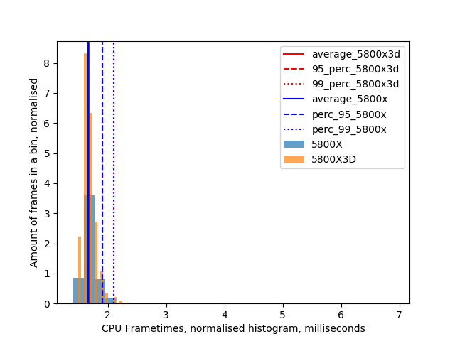
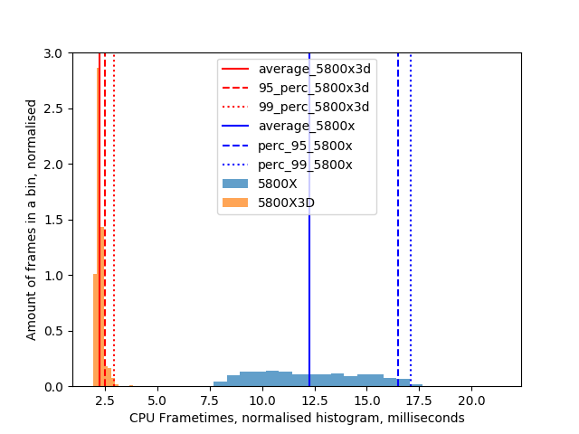
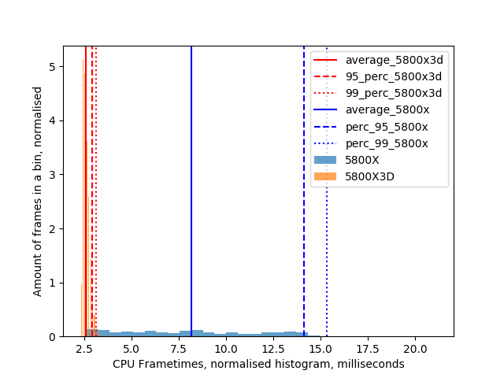

# Introduction

This repository details a benchmarking attempt to compare two different CPUs and their relative performance.
Two users join the same instance and compare CPU performance while standing in the same area.  
Except for the two worlds testing avatar performance, instances were private only with two users present.

Users have similar, albeit not identical, hardware aside from performance. 
To alleviate this, we consider only CPU frame times to eliminate error.
Frame timings were found using FPSVR.

# Update

Cross generational AMD benchmark 5800x3d vs 7800x3d on new VRChat from 2024

[Read here](https://github.com/Greendayle/VRChat-benchmark-cache/blob/main/amd-generations-test/summary.md)

Additional test Intel i9 11th gen vs 5800x3d

[Read here](https://github.com/Greendayle/VRChat-benchmark-cache/blob/main/intel-11th-vs-x3d/intel11-summary.md)

From those 2 tests we can extract one datapoint which is directly comparable:

# Hardware 
Person A: Valve Index, Nvidia 3090, AMD Ryzen 5800X, MB: MSI B550 PRO-A

Person B: Vive Pro 2, Nividia 3080, AMD Ryzen 5800X3D, MB: Gigabyte B550M DS3H

Resolution matched to 2500 x 2500 pixels per eye. 

Timings recorded on 2023.02.18 with VRChat build number 1281.

# Build your world

Relatively light udon world where you can spawn objects.
Two tests were done: One with an empty world to provide a baseline measurement, and another with all items spawned from the catalog.

https://vrchat.com/home/world/wrld_7786c206-d0e2-49c2-856d-a3aa018b2b94

## Build your world - Empty:

Baseline test to see how the world performs with minimal Udon and dynamic objects.

- 5800X3D average CPU frametimes: 1.68+-0.13 ms, 95 percentile: 1.90 ms, 99 percentile: 2.10 ms
- 5800X average CPU frametimes: 1.67+-0.20 ms, 95 percentile: 1.90 ms, 99 percentile: 2.10 ms

- 5800X3D average CPU FPS: 596.53+-42.66 FPS, 95 percentile: 526.32 FPS, 99 percentile: 476.19 FPS
- 5800X average CPU FPS: 600.15+-47.51 FPS, 95 percentile: 526.32 FPS, 99 percentile: 476.19 FPS

## Build your world - Full of objects, from spawn:

Compare how the world performs with many pickups and dynamic objects.

- 5800X3D average CPU frametimes: 2.22+-0.24 ms, 95 percentile: 2.50 ms, 99 percentile: 2.70 ms
- 5800X average CPU frametimes: 12.15+-2.55 ms, 95 percentile: 16.50 ms, 99 percentile: 17.30 ms

- 5800X3D average CPU FPS: 449.68+-32.88 FPS, 95 percentile: 400.00 FPS, 99 percentile: 370.37 FPS
- 5800X average CPU FPS: 82.28+-18.23 FPS, 95 percentile: 60.61 FPS, 99 percentile: 57.80 FPS

## Build your world - Full of objects, standing on a collider:

Compare how the world performs with many pickups and dynamic objects. 
Except now both users are standing on a collider (slight performance penalty).

- 5800X3D average CPU frametimes: 2.21+-0.24 ms, 95 percentile: 2.50 ms, 99 percentile: 2.90 ms
- 5800X average CPU frametimes: 12.27+-2.57 ms, 95 percentile: 16.50 ms, 99 percentile: 17.10 ms

- 5800X3D average CPU FPS: 451.48+-36.96 FPS, 95 percentile: 400.00 FPS, 99 percentile: 344.83 FPS
- 5800X average CPU FPS: 81.48+-22.22 FPS, 95 percentile: 60.59 FPS, 99 percentile: 58.48 FPS

# Avatar Museum 7

Relatively light world in terms of Udon and dynamics objects.
However there are many avatar pedestals present, incurring a cost on the CPU for rendering different meshes and materials.

https://vrchat.com/home/world/wrld_9e4737d6-76df-4e01-a065-f997ec031cd5

## Avatar museum - Spawn (1 room visible)

Compare how performance scales when only a single room worth of pedestals is visible (~8 pedestals per room).

- 5800X3D average CPU frametimes: 2.56+-0.18 ms, 95 percentile: 2.90 ms, 99 percentile: 3.10 ms
- 5800X average CPU frametimes: 8.17+-3.66 ms, 95 percentile: 14.10 ms, 99 percentile: 15.34 ms

- 5800X3D average CPU FPS: 389.94+-25.82 FPS, 95 percentile: 344.83 FPS, 99 percentile: 322.58 FPS
- 5800X average CPU FPS: 122.45+-82.20 FPS, 95 percentile: 70.92 FPS, 99 percentile: 65.21 FPS

## Avatar museum - Standing in the middle (2 rooms visible)

Compare performance when two rooms of pedestals are visible.

- 5800X3D average CPU frametimes: 3.71+-0.39 ms, 95 percentile: 4.10 ms, 99 percentile: 4.76 ms
- 5800X average CPU frametimes: 13.07+-2.10 ms, 95 percentile: 16.50 ms, 99 percentile: 16.87 ms

- 5800X3D average CPU FPS: 269.49+-18.56 FPS, 95 percentile: 243.90 FPS, 99 percentile: 210.04 FPS
- 5800X average CPU FPS: 76.48+-12.71 FPS, 95 percentile: 60.61 FPS, 99 percentile: 59.28 FPS

# Japanese Train Simulator

Udon heavy world, with lots of dynamic objects and Udon scripts.
Effectively a true train simulator, including many mechanics (boiler pressure, brake line pressure, etc).

https://vrchat.com/home/world/wrld_f466709e-f226-478f-a598-b8a4ba52aa70

## Train world - Watching the wagons

Looking from spawn looking at parked stationary wagons.

- 5800X3D average CPU frametimes: 8.82+-2.67 ms, 95 percentile: 12.30 ms, 99 percentile: 13.97 ms
- 5800X average CPU frametimes: 27.66+-4.85 ms, 95 percentile: 35.20 ms, 99 percentile: 37.00 ms

- 5800X3D average CPU FPS: 113.35+-47.06 FPS, 95 percentile: 81.30 FPS, 99 percentile: 71.58 FPS
- 5800X average CPU FPS: 36.15+-6.74 FPS, 95 percentile: 28.41 FPS, 99 percentile: 27.03 FPS

## Train world - Watching the city (away from wagons)

Looking from spawn, looking at the city (180 degrees from previous position).

- 5800X3D average CPU frametimes: 8.62+-2.54 ms, 95 percentile: 11.70 ms, 99 percentile: 12.70 ms
- 5800X average CPU frametimes: 26.76+-4.91 ms, 95 percentile: 33.70 ms, 99 percentile: 35.01 ms

- 5800X3D average CPU FPS: 116.00+-50.37 FPS, 95 percentile: 85.47 FPS, 99 percentile: 78.74 FPS
- 5800X average CPU FPS: 37.37+-7.65 FPS, 95 percentile: 29.67 FPS, 99 percentile: 28.56 FPS

## Train world - Began train simulation, driving away without wagons while looking forward

Began the engine, engaging the simulation proper. 
Driving away from spawn and looking forward.

- 5800X3D average CPU frametimes: 7.22+-2.47 ms, 95 percentile: 12.00 ms, 99 percentile: 15.70 ms
- 5800X average CPU frametimes: 29.82+-5.11 ms, 95 percentile: 38.00 ms, 99 percentile: 39.70 ms

- 5800X3D average CPU FPS: 138.56+-39.95 FPS, 95 percentile: 83.33 FPS, 99 percentile: 63.69 FPS
- 5800X average CPU FPS: 33.54+-6.10 FPS, 95 percentile: 26.32 FPS, 99 percentile: 25.19 FPS

# The Great Pug

Public instance.
Chose a busy instance with many users present in their avatars to identify how avatars affect CPU performance. 
No safety settings enabled.

https://vrchat.com/home/world/wrld_6caf5200-70e1-46c2-b043-e3c4abe69e0f

## The Great Pug, stage area, big group of people in view

- 5800X3D average CPU frametimes: 13.90+-3.43 ms, 95 percentile: 18.80 ms, 99 percentile: 22.56 ms
- 5800X average CPU frametimes: 30.25+-5.11 ms, 95 percentile: 37.77 ms, 99 percentile: 39.64 ms

- 5800X3D average CPU FPS: 71.94+-20.74 FPS, 95 percentile: 53.19 FPS, 99 percentile: 44.32 FPS
- 5800X average CPU FPS: 33.06+-6.39 FPS, 95 percentile: 26.47 FPS, 99 percentile: 25.22 FPS

# Just B Club 3

Public instance.
Chose a busy instance with many users present in their avatars to identify how avatars affect CPU performance. 
No safety settings enabled.

https://vrchat.com/home/world/wrld_b2d9f284-3a77-4a8a-a58e-f8427f87ba79

## Just B Club 3, spawn, big group of avatars in view:

- 5800X3D average CPU frametimes: 12.39+-3.18 ms, 95 percentile: 17.00 ms, 99 percentile: 19.77 ms
- 5800X average CPU frametimes: 27.98+-5.89 ms, 95 percentile: 36.40 ms, 99 percentile: 37.60 ms

- 5800X3D average CPU FPS: 80.70+-23.98 FPS, 95 percentile: 58.82 FPS, 99 percentile: 50.58 FPS
- 5800X average CPU FPS: 35.74+-14.86 FPS, 95 percentile: 27.47 FPS, 99 percentile: 26.60 FPS

# Conclusion

The 5800X3D is around 2-6 times faster than 5800X where there are many dynamic objects and or avatars. 
It also has and has WAY smaller frametiming variance.

In lighter worlds, no significant difference is observed.
This is due to the larger CPU cache being more important when there are many dynamic objects or avatars on screen.

# Disclosure of conflict of interest

I've bought 5600X and then upgraded to 5800X3D, this was done to silence my looming buyers remorse, which was false.
